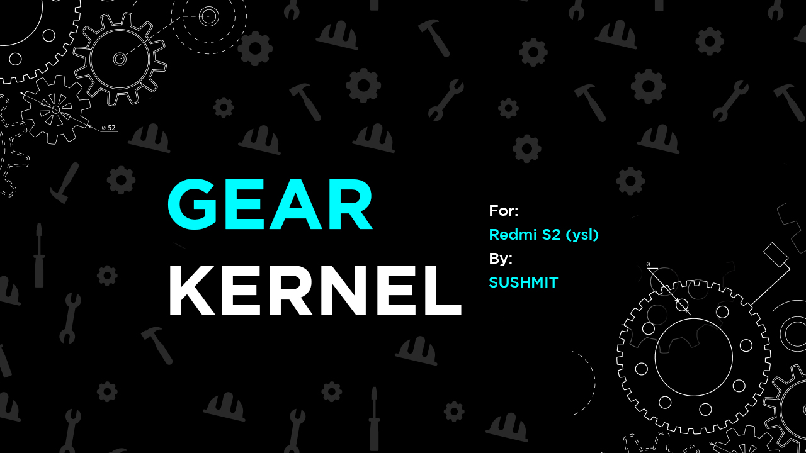

# Gear Kernel for Xiaomi Redmi S2 (YSL)

## Device specifications

| Feature                 | Specification                     |
| :---------------------- | :-------------------------------- |
| CPU                     | Octa-core 2.0 GHz Cortex-A53      |
| Chipset                 | Qualcomm MSM8953 Snapdragon 625   |
| GPU                     | Adreno 506                        |
| Memory                  | 3/4 GB                            |
| Shipped Android Version | 8.1.0                             |
| Storage                 | 32/64 GB                          |
| MicroSD                 | Up to 256 GB                      |
| Battery                 | 3080 mAh (non-removable)          |
| Dimensions              | 160.7 x 77.3 x 8.1 mm             |
| Display                 | 720 x 1440  pixels (~269 ppi)     |
| Rear Camera             | 12 MP, f/2.2, 1.25 μm, PDAF       |
|                         | 5 MP, f/2.2, 1.12 μm, depth sensor|
| Front Camera            | 5 MP, f/2.0                       |
| Announced Date          | May 2018                          |

## Features
- Always updates with latest linux tag.
- Compiled with proton clang.
- Slew of TCP Congestion Algorithms.
- Sultan's perf critical IRQ framework to affine fast CPUs.
- Sultan's simple low memory killer.
- f2fs improvements.
- For more check github.
